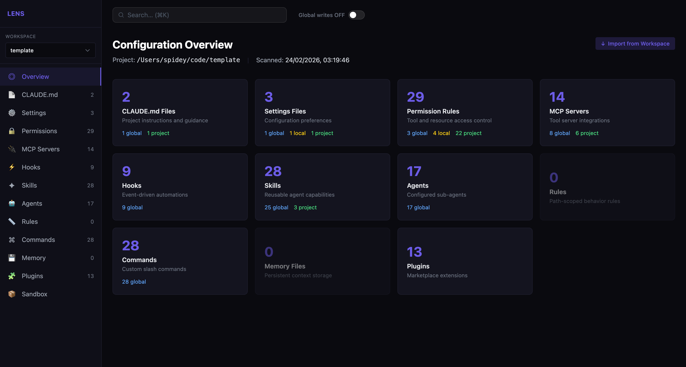
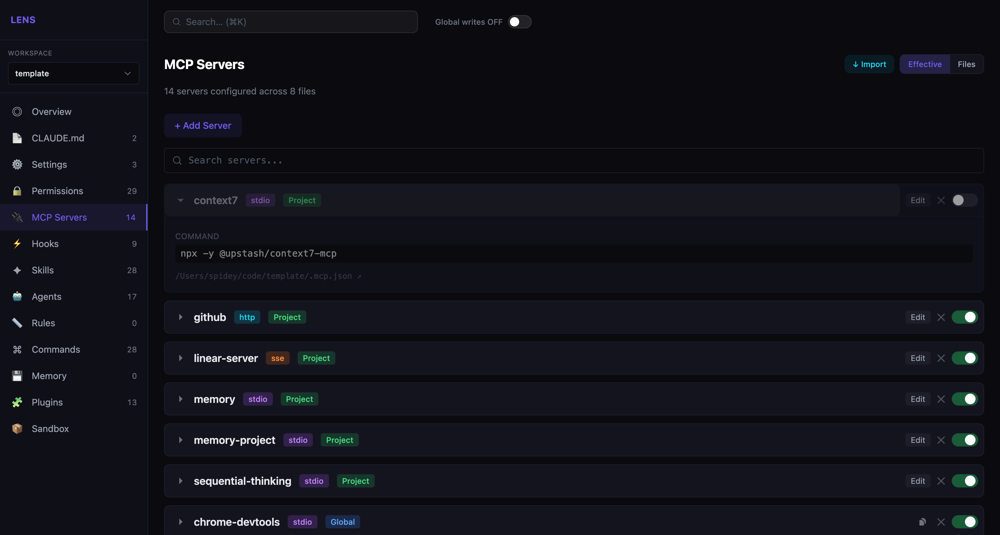
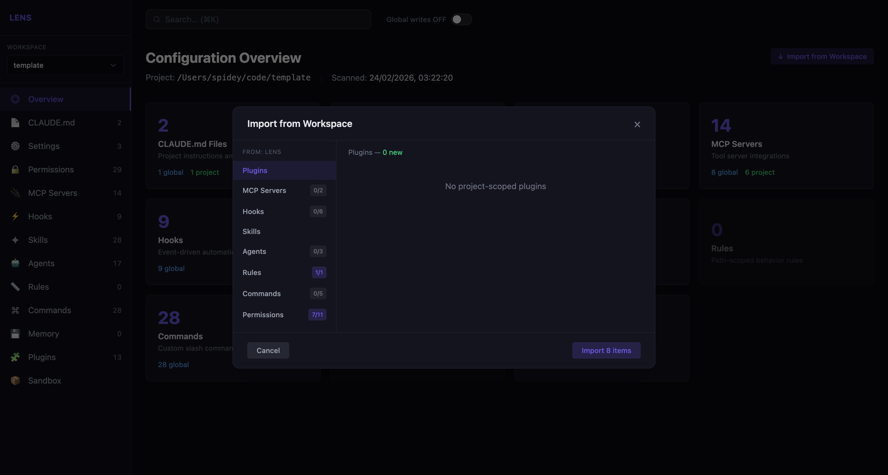
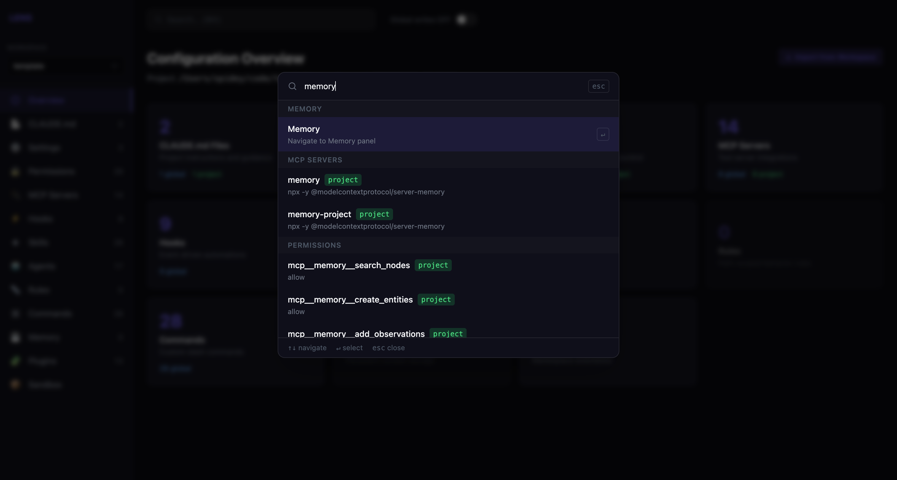

# Lens

A web dashboard for Claude Code. See and edit all 13 configuration surfaces — CLAUDE.md, settings, permissions, MCP servers, hooks, skills, agents, rules, commands, plugins, memory, models, sandbox — across every scope level in one place.



## Install

**Step 1:** Add the Lens marketplace (one-time):

```
/plugins add-marketplace github:ugudlado/lens
```

**Step 2:** Install the plugin:

```
/plugins install lens@ugudlado
```

**Step 3:** Open the dashboard:

```
/lens:open
```

> Global config (`~/.claude/`) is read-only by default. Use the toggle in the top-right to enable global writes.

## Features

### All 13 config surfaces in one view

The overview shows every surface with counts — click any card to drill in. Hooks, skills, agents, MCP servers, commands, permissions and more, all in one place.

### Switch between repos instantly

Lens works across all your projects. Switch workspaces from the sidebar to inspect any repo's config without leaving the dashboard.

### Scope-aware display

Every entry shows which scope it lives in — Global, Project, or Local. The **Effective** view merges all scopes to show what Claude actually sees. The **Files** view breaks it down file-by-file.



### Import from another workspace

Bootstrap a new project by pulling config from an existing one. Select a workspace, review what's new, pick what to import.



### Edit in place

Add, edit, enable/disable, or delete config entries directly. Copy or move entries between scope levels.

### Universal search

Hit `⌘K` to search across all config surfaces and workspaces at once — find any MCP server, hook, skill, or permission across all your repos.



### Live reload

File watcher pushes changes to the UI the moment a config file changes on disk — no manual refresh needed.

## Development

```bash
git clone https://github.com/ugudlado/lens.git
cd lens
pnpm install
pnpm dev
```

Opens the UI at `http://localhost:3000` with the backend on `http://localhost:37001`.

```bash
pnpm build        # Build all packages (schema → server → UI)
pnpm type-check   # Type-check all packages
```

See [docs/ARCHITECTURE.md](docs/ARCHITECTURE.md) for technical details.

## Contributing

1. Fork the repo and create a feature branch
2. `pnpm install && pnpm dev`
3. Make your changes — validate with `pnpm type-check`
4. Open a pull request

## License

MIT — see [LICENSE](./LICENSE)
